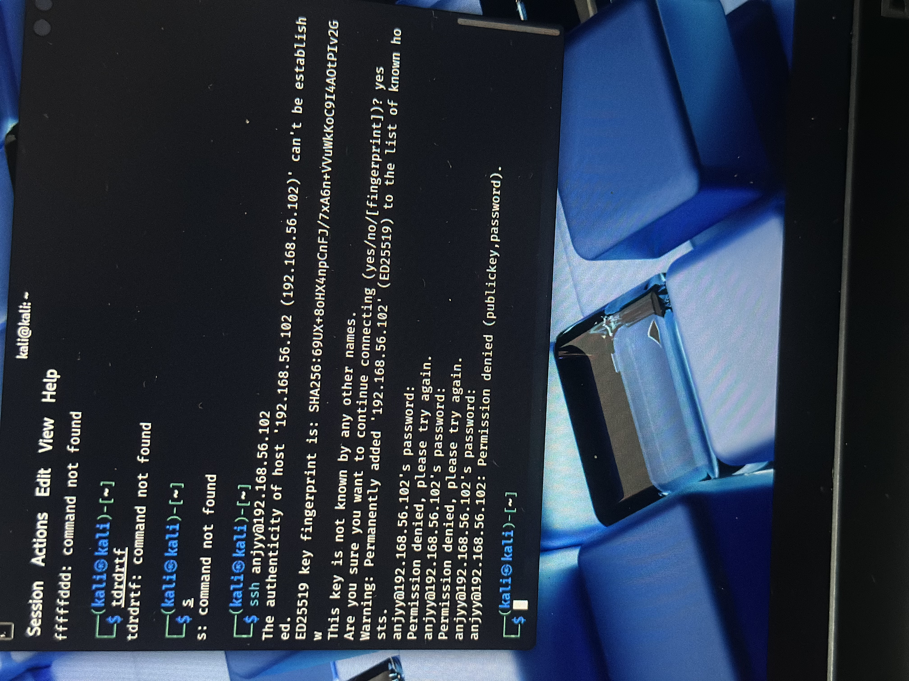

# Incident Report: SSH Brute-Force Attempt Against WazuhServer

**Analyst:** [WorkWithAnjola]
**Date of Investigation:** July 14–15, 2026
**Environment:** Home SOC Lab (Wazuh SIEM on Ubuntu Server + Kali Linux attacker VM, VirtualBox host-only network)

---

## 1. Executive Summary

Two SSH brute-force authentication attempts were executed against the `wazuhserver` host from `192.168.56.1`, targeting the local user account `anjyy`, approximately one hour apart on July 14, 2026.

- **Attempt #1 (~21:30 UTC)** was **not detected** by Wazuh, despite being clearly visible in the system journal.
- **Attempt #2 (~22:31 UTC)** was **successfully detected**, generating a high severity alert (rule level 10) after 7 recorded hits.

Root-cause analysis determined the missed detection on the first attempt was not a rule, decoder, or configuration failure. it was caused by the **Wazuh manager service not yet being active** at the time of the attack. The manager's `systemctl` status confirmed it had only started at 22:00:39 UTC, roughly 30 minutes *after* the first attack occurred. By the time the second attempt was run, the manager was fully running and correctly detected and escalated the activity.

---

## 2. Timeline of Events

| Timestamp (Jul 14, 2026) | Event | Source |
|---|---|---|
| 21:30:52 | PAM authentication failure logged for user `anjyy` from `192.168.56.1` | `journalctl -u ssh` |
| 21:30:54 | Failed password attempt #1 (SSH session PID 5454, source port 54503) | `journalctl -u ssh` |
| 21:31:11 | Failed password attempt #2 | `journalctl -u ssh` |
| 21:31:18 | Failed password attempt #3 | `journalctl -u ssh` |
| 21:31:20 | PAM reports "2 more authentication failures" — 5 total failed attempts confirmed | `journalctl -u ssh` |
| Post-attempt #1 | Wazuh `alerts.json` queried for corresponding alert — **no match found** | `alerts.json` |
| 22:00:39 | Wazuh manager service confirmed **active (running)** — started at this time, ~30 min after attempt #1 | `systemctl status wazuh-manager` |
| 22:31:18 – 22:31:21 | Attempt #2: repeated failed SSH logins for `anjyy` from `192.168.56.1` | Wazuh Discover / `wazuh-alerts-*` |
| 22:31:21 | **Alert generated** — rule level 10, "User missed the password more than one time," 7 total hits | Wazuh Discover |

**Note:** Attempt #1 originated from a single SSH session (PID 5454) and source port (54503), indicating one persistent connection retrying credentials rather than a distributed or multi-connection automated tool (e.g., Hydra's default multi socket behavior). This is a relevant detail for assessing attacker tooling/sophistication.

---

## 3. Indicators of Compromise (IOCs)

| Type | Value |
|---|---|
| Source IP | `192.168.56.1` |
| Target Host | `wazuhserver` |
| Target User | `anjyy` |
| Target Service | SSH (port 22) |
| SSH Session PID (Attempt #1) | 5454 |
| Source Port (Attempt #1) | 54503 |
| Failed Attempts (Attempt #1) | 5 (within 28 seconds) — undetected |
| Failed Attempts (Attempt #2) | 7 hits recorded — detected, rule level 10 |
| Wazuh Rule Description | "User missed the password more than one time" |
| Wazuh Rule Groups | syslog, access_control, authentication_failed |

---

## 4. MITRE ATT&CK Mapping

| Technique | ID | Notes |
|---|---|---|
| Brute Force: Password Guessing | T1110.001 | Repeated failed authentication attempts against a single valid username |
| Valid Accounts (targeted) | T1078 | Attack targeted a known/existing local account rather than random usernames |

*(Tactic: Credential Access)*

---

## 5. Key Finding: SIEM Detection Gap (Root Cause Confirmed)

The first attack attempt (~21:30 UTC) was fully visible at the OS/journald level but produced **no alert in Wazuh**. Investigation initially considered several possibilities decoder mismatches with `journald`-formatted logs, missing archive/full log ingestion (`logall`), and agent enrollment issues — and ruled each one out systematically:

- The Wazuh agent (`wazuhserver`, ID 000) was confirmed active and locally enrolled.
- `ossec.conf` had a `<localfile>` block correctly pointing to `journald` as a log source.
- Archive logging (`<logall>`/`<logall_json>`) was disabled, which limited retroactive visibility into raw ingestion — but was not, in the end, the root cause.

**The actual root cause was simpler:** the Wazuh manager service had not yet started at the time of the first attack. `systemctl status wazuh-manager` confirmed the service became active at **22:00:39 UTC** — roughly 30 minutes *after* the first brute-force attempt occurred at 21:30. The SIEM had no possible way to detect an attack that happened before it was running.

This was confirmed by re running the identical attack (~22:31 UTC) after the manager had been up and stable for over 30 minutes. That attempt was detected correctly and escalated to a level-10 alert with 7 recorded hits.

This is still a legitimate and common real-world SOC lesson: **a monitoring stack that isn't confirmed running before an incident window provides zero coverage during that gap, no matter how well it's configured.** Verifying service uptime and readiness is as important as verifying rule/decoder correctness.

---

## 6. Recommendations

1. **Verify manager/service uptime before relying on detection coverage.** A simple `systemctl status wazuh manager` check (or automated health check) should be part of any pre-exercise or pre-shift checklist in a SOC environment.
2. **Enable archive logging** (`<logall>yes</logall>` and `<logall_json>yes</logall_json>` in `ossec.conf`) going forward, to retain all ingested events — not just alert-matched ones — which speeds up root-cause diagnosis for any future detection gaps.
3. **Configure the Wazuh manager to start on boot** (`systemctl enable wazuhmanager`) to minimize windows where the host is exposed but unmonitored, especially in a lab environment where VMs are frequently powered on/off.
4. **Implement active response** (e.g., Wazuh's `active-response` with `firewall drop`) for repeated SSH authentication failures, to move from passive alerting to automated containment once detection is confirmed reliable.
5. **Establish a monitoring "readiness check" habit** before any test or exercise confirming the SIEM is not just installed but actively running and ingesting rather than assuming an agent shown as "active" in enrollment means full coverage.

---

## 7. Lessons Learned

The most valuable outcome of this investigation wasn't the second, successful detection, it was systematically ruling out configuration and decoder issues before finding the actual, much simpler root cause: the monitoring service itself wasn't running yet during the first attack window. This is a realistic and important SOC lesson: verifying a security tool is actually online and ready is a prerequisite to trusting its alerts, and detection gaps are sometimes operational rather than technical.

---

## 8. Attacker Perspective

The screenshot below shows the attack from the Kali Linux side — a manual SSH connection attempt (`ssh anjyy@192.168.56.102`), host key acceptance, and 3 password attempts before the connection was rejected (`Permission denied (publickey,password)`).

This confirms the attack was executed manually from a single terminal session consistent with the single SSH session/source port observed server side rather than via an automated multiconnection tool (e.g., Hydra). This detail is relevant to assessing the simulated attacker's tooling and sophistication level.
